---
## Front matter
title: "Операционные системы"
subtitle: "Лабораторная работа №2"
author: "Хамдамова Айжана НКАбд-05-22"

## Generic otions
lang: ru-RU
toc-title: "Содержание"

## Bibliography
bibliography: bib/cite.bib
csl: pandoc/csl/gost-r-7-0-5-2008-numeric.csl

## Pdf output format
toc: true # Table of contents
toc-depth: 2
lof: true # List of figures
lot: true # List of tables
fontsize: 12pt
linestretch: 1.5
papersize: a4
documentclass: scrreprt
## I18n polyglossia
polyglossia-lang:
  name: russian
  options:
	- spelling=modern
	- babelshorthands=true
polyglossia-otherlangs:
  name: english
## I18n babel
babel-lang: russian
babel-otherlangs: english
## Fonts
mainfont: PT Serif
romanfont: PT Serif
sansfont: PT Sans
monofont: PT Mono
mainfontoptions: Ligatures=TeX
romanfontoptions: Ligatures=TeX
sansfontoptions: Ligatures=TeX,Scale=MatchLowercase
monofontoptions: Scale=MatchLowercase,Scale=0.9
## Biblatex
biblatex: true
biblio-style: "gost-numeric"
biblatexoptions:
  - parentracker=true
  - backend=biber
  - hyperref=auto
  - language=auto
  - autolang=other*
  - citestyle=gost-numeric
## Pandoc-crossref LaTeX customization
figureTitle: "Рис."
tableTitle: "Таблица"
listingTitle: "Листинг"
lofTitle: "Список иллюстраций"
lotTitle: "Список таблиц"
lolTitle: "Листинги"
## Misc options
indent: true
header-includes:
  - \usepackage{indentfirst}
  - \usepackage{float} # keep figures where there are in the text
  - \floatplacement{figure}{H} # keep figures where there are in the text
---

# Цель работы
Изучить идеологию и применение средств контроля версий.
Освоить умения по работе с git.

# Теоретическое введение
Системы контроля версий (Version Control System, VCS) применяются при работе нескольких человек над одним проектом. Обычно основное дерево проекта хранится в локальном или удалённом репозитории, к которому настроен доступ для участников проекта. При внесении изменений в содержание проекта система контроля версий позволяет их фиксировать, совмещать изменения, произведённые разными участниками проекта, производить откат к любой более ранней версии проекта, если это требуется.

В классических системах контроля версий используется централизованная модель, предполагающая наличие единого репозитория для хранения файлов. Выполнение большинства функций по управлению версиями осуществляется специальным сервером. Участник проекта (пользователь) перед началом работы посредством определённых команд получает нужную ему версию файлов. После внесения изменений, пользователь размещает новую версию в хранилище. При этом предыдущие версии не удаляются из центрального хранилища и к ним можно вернуться в любой момент. Сервер может сохранять не полную версию изменённых файлов, а производить так называемую дельта-компрессию — сохранять только изменения между последовательными версиями, что позволяет уменьшить объём хранимых данных.

Системы контроля версий поддерживают возможность отслеживания и разрешения конфликтов, которые могут возникнуть при работе нескольких человек над одним файлом. Можно объединить (слить) изменения, сделанные разными участниками (автоматически или вручную), вручную выбрать нужную версию, отменить изменения вовсе или заблокировать файлы для изменения. В зависимости от настроек блокировка не позволяет другим пользователям получить рабочую копию или препятствует изменению рабочей копии файла средствами файловой системы ОС, обеспечивая таким образом, привилегированный доступ только одному пользователю, работающему с файлом.

# Выполнение лабораторной работы

 1. Установка гита(рис.1 @fig:001)(рис. @fig:045)

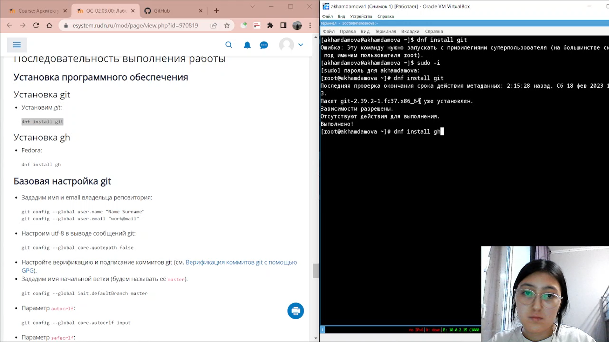{#fig:001 width=70%}
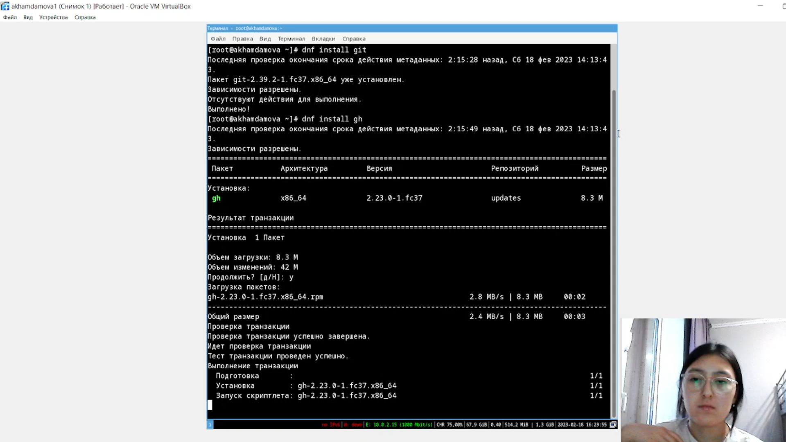{#fig:045 width=70%}

 2. Задаем имя и email(рис.3 @fig:002).
 
 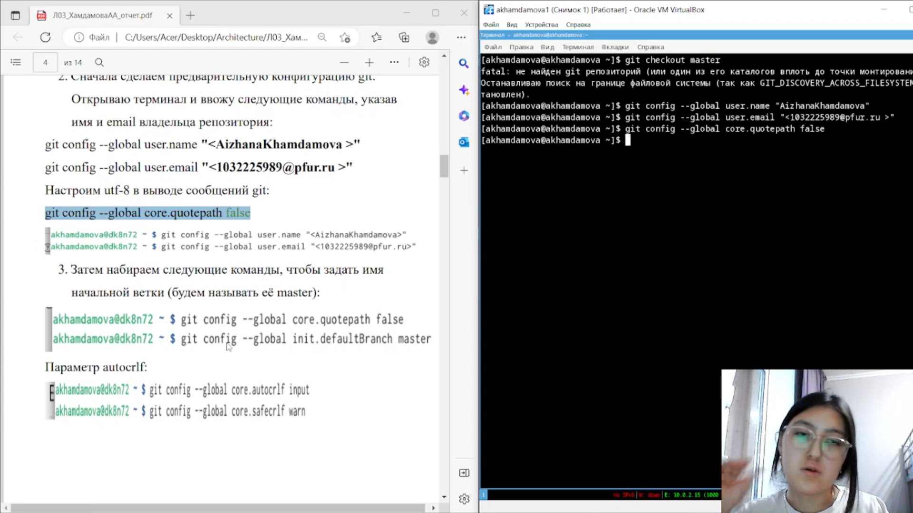{#fig:002 width=70%}
 
 3. Настроим utf-8 в выводе сообщений git с помощью команды git config --global core.quotepath false (рис.3 @fig:003)
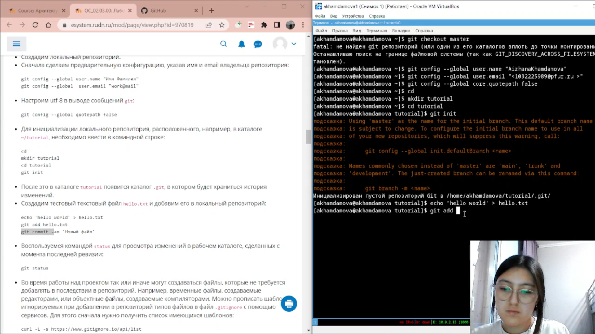{#fig:003 width=70%}

 4. Задаем праметры autocrlf и safecrlf(рис.4 @fig:004) (рис.4 @fig:005)
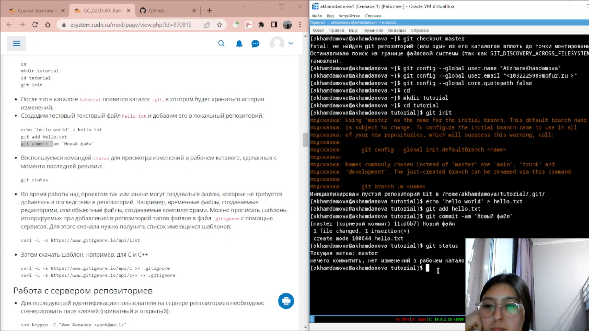{#fig:004 width=70%}
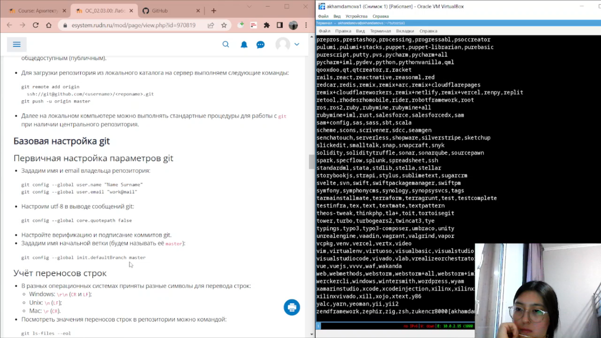{#fig:005 width=70%}

5. Создаем  каталог туториал и текстовый файл "Hello world" (рис.4 @fig:006)
{#fig:006 width=70%}

6. Создаем ключи SSH и PGP (рис.4 @fig:007) Задаем параметры(рис.5 @fig:008) 
 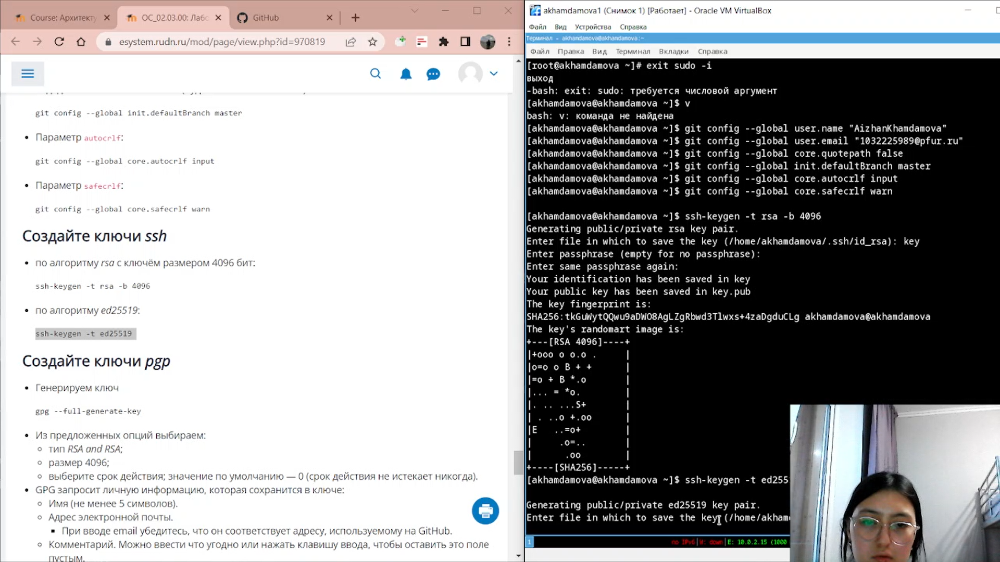{#fig:007 width=70%}
 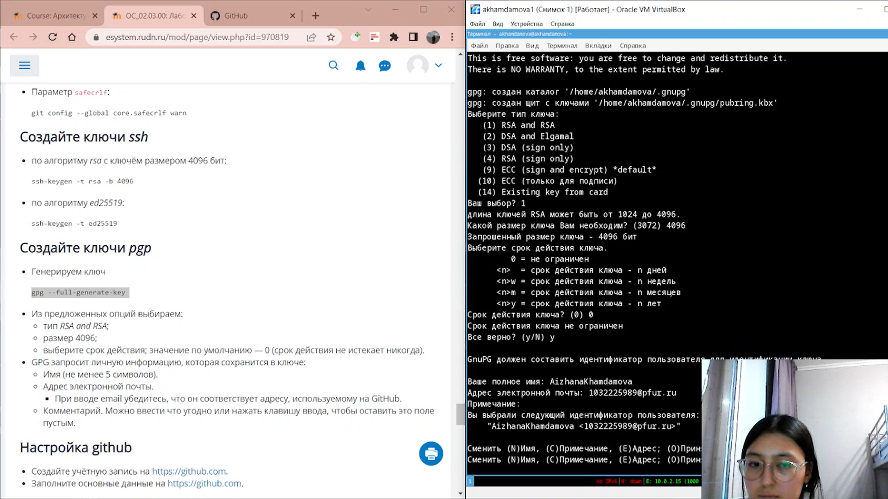{#fig:008 width=70%}
 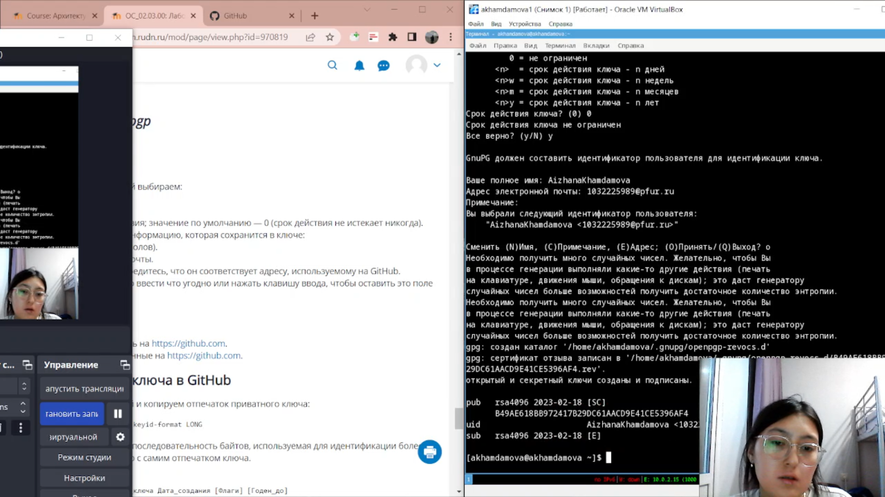{#fig:009 width=70%}
 
 7. Привязка и вход в аккаунт гита через терминал (рис. @fig:010)(рис. @fig:011)
 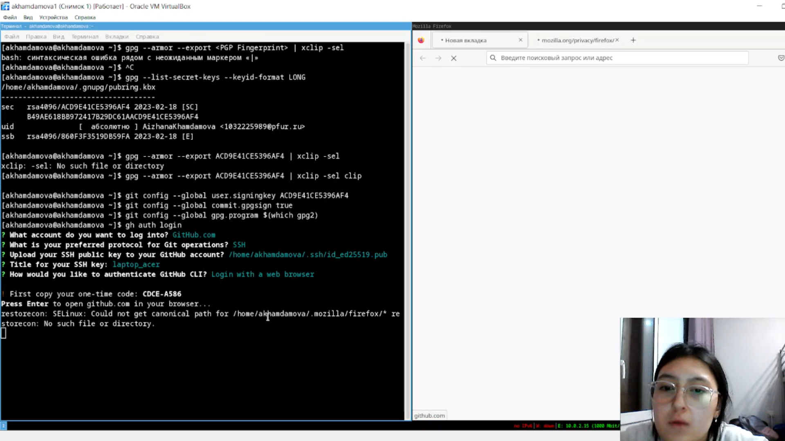{#fig:010 width=70%}
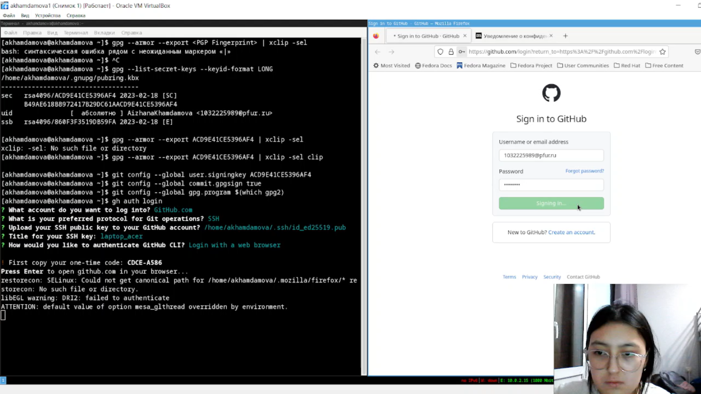{#fig:011 width=70%}
# Выводы
Вывод я научилась работать и оформлять свои отчеты в md формате. 

# Список литературы{.unnumbered}

::: {#refs}
:::
