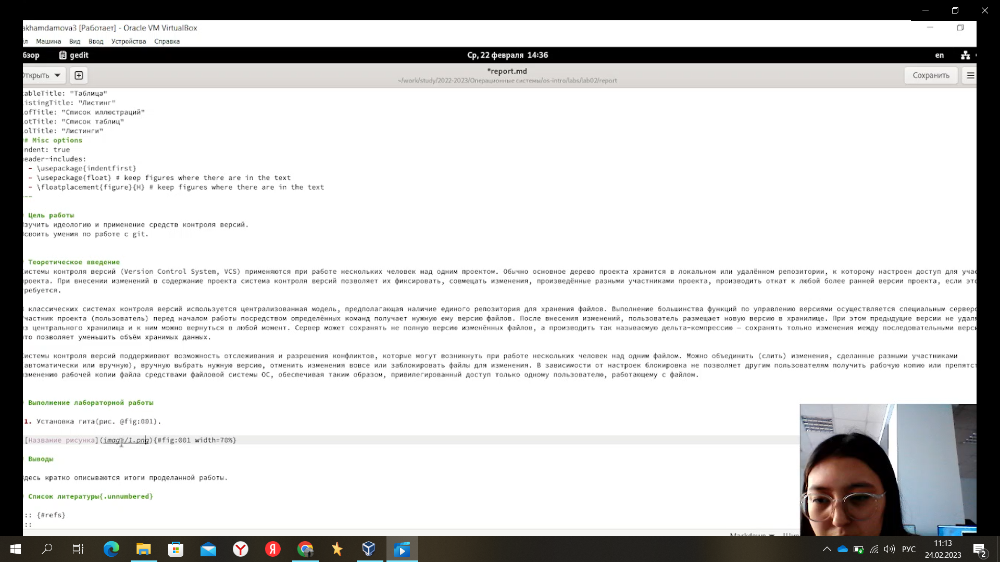

---
## Front matter
title: "Лабораторная работа №3"
subtitle: Операционные системы"
author: "Хамдамова Айжана НКАбд-05-22"

## Generic otions
lang: ru-RU
toc-title: "Содержание"

## Bibliography
bibliography: bib/cite.bib
csl: pandoc/csl/gost-r-7-0-5-2008-numeric.csl

## Pdf output format
toc: true # Table of contents
toc-depth: 2
lof: true # List of figures
lot: true # List of tables
fontsize: 12pt
linestretch: 1.5
papersize: a4
documentclass: scrreprt
## I18n polyglossia
polyglossia-lang:
  name: russian
  options:
	- spelling=modern
	- babelshorthands=true
polyglossia-otherlangs:
  name: english
## I18n babel
babel-lang: russian
babel-otherlangs: english
## Fonts
mainfont: PT Serif
romanfont: PT Serif
sansfont: PT Sans
monofont: PT Mono
mainfontoptions: Ligatures=TeX
romanfontoptions: Ligatures=TeX
sansfontoptions: Ligatures=TeX,Scale=MatchLowercase
monofontoptions: Scale=MatchLowercase,Scale=0.9
## Biblatex
biblatex: true
biblio-style: "gost-numeric"
biblatexoptions:
  - parentracker=true
  - backend=biber
  - hyperref=auto
  - language=auto
  - autolang=other*
  - citestyle=gost-numeric
## Pandoc-crossref LaTeX customization
figureTitle: "Рис."
tableTitle: "Таблица"
listingTitle: "Листинг"
lofTitle: "Список иллюстраций"
lotTitle: "Список таблиц"
lolTitle: "Листинги"
## Misc options
indent: true
header-includes:
  - \usepackage{indentfirst}
  - \usepackage{float} # keep figures where there are in the text
  - \floatplacement{figure}{H} # keep figures where there are in the text
---

# Цель работы

Научиться оформлять отчёты с помощью легковесного языка разметки Markdown.

# Теоретическое введение

Чтобы создать заголовок, используйте знак ( # ), например:
1 # This is heading 1
2 ## This is heading 2
3 ### This is heading 3
4 #### This is heading 4
Чтобы задать для текста полужирное начертание, заключите его в двойные звездочки:
1 This text is **bold**.
Чтобы задать для текста курсивное начертание, заключите его в одинарные звездочки:
1 This text is *italic*.
Чтобы задать для текста полужирное и курсивное начертание, заключите его в тройные
звездочки:
1 This is text is both ***bold and italic***.
Блоки цитирования создаются с помощью символа >:
1 > The drought had lasted now for ten million years, and the reign of
the terrible lizards had long since ended. Here on the Equator, in
the continent which would one day be known as Africa, the battle
for existence had reached a new climax of ferocity, and the victor
was not yet in sight. In this barren and desiccated land, only the
small or the swift or the fierce could flourish, or even hope to
survive.
↪
↪
↪
↪
↪
↪
Неупорядоченный (маркированный) список можно отформатировать с помощью звездочек или тире:
1 - List item 1
2 - List item 2
3 - List item 3
Чтобы вложить один список в другой, добавьте отступ для элементов дочернего списка:
34 Лабораторная работа № 3. Markdown
1 - List item 1
2 - List item A
3 - List item B
4 - List item 2
Упорядоченный список можно отформатировать с помощью соответствующих цифр:
1 1. First instruction
2 1. Second instruction
3 1. Third instruction
Чтобы вложить один список в другой, добавьте отступ для элементов дочернего списка:
1 1. First instruction
2 1. Sub-instruction
3 1. Sub-instruction
4 1. Second instruction
Синтаксис Markdown для встроенной ссылки состоит из части [link text] , представляющей текст гиперссылки, и части (file-name.md) – URL-адреса или имени файла,
на который дается ссылка:
1 [link text](file-name.md)
Markdown поддерживает как встраивание фрагментов кода в предложение, так и их
размещение между предложениями в виде отдельных огражденных блоков. Огражденные
блоки кода — это простой способ выделить синтаксис для фрагментов кода. Общий
формат огражденных блоков кода
# Выполнение лабораторной работы

1. Меняем название лабораторной,автора и дисциплины (рис. @fig:001).

{#fig:001 width=70%}

2. Прописываем цели, выполнение работы, теоритическое введение(рис. @fig:002).

{#fig:002 width=70%}

3. Вставляем скриншоты в файл (рис. @fig:003).

{#fig:003 width=70%}

4. Добавляем ссылки на рисунки(рис. @fig:004).

{#fig:004 width=70%}

# Выводы

Я научилась работать и оформлять отчеты по лабораторным работам в формате markdown.

# Список литературы{.unnumbered}

::: {#refs}
:::
