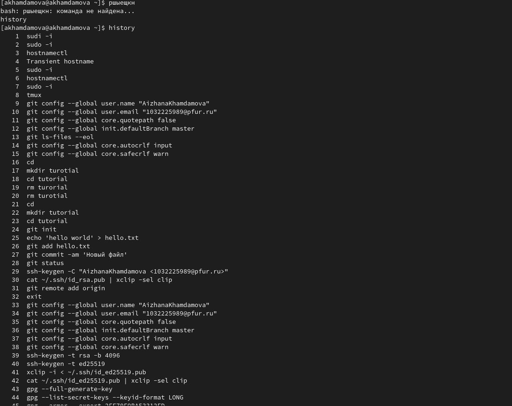

---
## Front matter
title: "Лабораторная работа №4"
subtitle: "Основы интерфейса взаимодействия пользователя с системой Unix на уровне командной строки"
author: "Хамдамова Айжана"

## Generic otions
lang: ru-RU
toc-title: "Содержание"

## Bibliography
bibliography: bib/cite.bib
csl: pandoc/csl/gost-r-7-0-5-2008-numeric.csl

## Pdf output format
toc: true # Table of contents
toc-depth: 2
lof: true # List of figures
lot: true # List of tables
fontsize: 12pt
linestretch: 1.5
papersize: a4
documentclass: scrreprt
## I18n polyglossia
polyglossia-lang:
  name: russian
  options:
	- spelling=modern
	- babelshorthands=true
polyglossia-otherlangs:
  name: english
## I18n babel
babel-lang: russian
babel-otherlangs: english
## Fonts
mainfont: PT Serif
romanfont: PT Serif
sansfont: PT Sans
monofont: PT Mono
mainfontoptions: Ligatures=TeX
romanfontoptions: Ligatures=TeX
sansfontoptions: Ligatures=TeX,Scale=MatchLowercase
monofontoptions: Scale=MatchLowercase,Scale=0.9
## Biblatex
biblatex: true
biblio-style: "gost-numeric"
biblatexoptions:
  - parentracker=true
  - backend=biber
  - hyperref=auto
  - language=auto
  - autolang=other*
  - citestyle=gost-numeric
## Pandoc-crossref LaTeX customization
figureTitle: "Рис."
tableTitle: "Таблица"
listingTitle: "Листинг"
lofTitle: "Список иллюстраций"
lotTitle: "Список таблиц"
lolTitle: "Листинги"
## Misc options
indent: true
header-includes:
  - \usepackage{indentfirst}
  - \usepackage{float} # keep figures where there are in the text
  - \floatplacement{figure}{H} # keep figures where there are in the text
---

# Цель работы

Приобретение практических навыков взаимодействия пользователя с системой посредством командной строки.

# Теоретическое введение

Формат команды. Командой в операционной системе называется записанный по
специальным правилам текст (возможно с аргументами), представляющий собой указание на выполнение какой-либо функций (или действий) в операционной системе.
Обычно первым словом идёт имя команды, остальной текст — аргументы или опции,
конкретизирующие действие.
Общий формат команд можно представить следующим образом:
<имя_команды><разделитель><аргументы>

*Команда man. Команда man используется для просмотра (оперативная помощь) в диалоговом режиме руководства (manual) по основным командам операционной системы
типа Linux 

* Команда cd. Команда cd используется для перемещения по файловой системе операционной системы типа Linux.

* Команда pwd. Для определения абсолютного пути к текущему каталогу используется
команда pwd (print working directory).

* Команда ls. Команда ls используется для просмотра содержимого каталога.
Формат команды:
ls [-опции] [путь]

* Команда mkdir. Команда mkdir используется для создания каталогов.
Формат команды:
mkdir имя_каталога1 [имя_каталога2...]

* Команда rm. Команда rm используется для удаления файлов и/или каталогов.
Формат команды:
rm [-опции] [файл]
Если требуется, чтобы выдавался запрос подтверждения на удаление файла, то необходимо использовать опцию i.
Чтобы удалить каталог, содержащий файлы, нужно использовать опцию r. Без указания
этой опции команда не будет выполняться.

* Команда history. Для вывода на экран списка ранее выполненных команд используется команда history. Выводимые на экран команды в списке нумеруются. К любой
команде из выведенного на экран списка можно обратиться по её номеру в списке,
воспользовавшись конструкцией !<номер_команды>.

# Выполнение лабораторной работы

1. Определим полное имя нашего домашнего каталога(рис. @fig:001).

{#fig:001 width=70%}

2. Перейдем в каталог /tmp (рис. @fig:002).

{#fig:002 width=70%}

3. Выводим на экран содержимое каталога /tmp (рис. @fig:003).

{#fig:003 width=70%}

4. Различные опции ls (рис. @fig:004).

{#fig:004 width=70%}

5. Вв каталоге /var/spool нет подкаталога с именем cron (рис. @fig:005).

{#fig:005 width=70%}

6. Переходим в домашний каталог и выведем на экран его содержимое. Определим, кто является владельцем файлов и подкаталогов(рис. @fig:006).

{#fig:006 width=70%}

7. В домашнем каталоге создаем новый каталог с именем newdir.
3.2. В каталоге ~/newdir создадим новый каталог с именем morefun (рис. @fig:007).

{#fig:007 width=70%}

8. В домашнем каталоге создадим одной командой три новых каталога с именами
letters, memos, misk. Затем удалим эти каталоги одной командой.(рис. @fig:008).

{#fig:008 width=70%}

9. . Попробуйте удалить ранее созданный каталог ~/newdir командой rm. 
**Каталог не был ли  удалён.**
Удалим каталог ~/newdir/morefun из домашнего каталога. **Да, с помощью комнады rm -r каталоги удалились**

10. . С помощью команды man определим, какую опцию команды ls нужно использовать для просмотра содержимое не только указанного каталога, но и подкаталогов, входящих в него (рис. @fig:009).
 **команда ls -f**

{#fig:009 width=70%}

11. С помощью команды man определим набор опций команды ls, позволяющий отсортировать по времени последнего изменения выводимый список содержимого каталога с развёрнутым описанием файлов(рис. @fig:010).

{#fig:010 width=70%}

12. Используем команду man для просмотра описания следующих команд: cd, pwd,mkdir,rmdir, rm. (рис. @fig:012).

{#fig:012 width=70%}

13.  при помощи команды history, выполниv модификацию и исполнение нескольких команд из буфера команд (рис. @fig:014).

{#fig:014 width=70%}

 
# Контрольные вопросы:

1. Командная строка (Терминал) – это специальная программа, которая позволяет управлять компьютером путем ввода текстовых команд с клавиатуры.

2. При помощи команды pwd можно определить абсолютный путь текущего каталога

3. При помощи  команды ls -f и каких опций можно определить только тип файлов и их имена в текущем каталоге
4. ls -a может отобразить информацию о скрытых файлах

5. . При помощи команд rm можно удалить файл и каталог. Можно это сделать oдной и той же командой rm -r 
6. С помощью команды history можно вывести информацию о последних выполненных пользователем командах
7. Можно воспользоваться историей команд для их модифицированного выполнения с помощью команды !<номер_команды>:s/<что_меняем>/<на_что_меняем> (пример представлен в лабораторной чуть выше)
8. В одной командной строке вы можете указать несколько команд. Эти команды должны быть разделены символом ; или символом & ( cd; pwd; ls)
9. Экранирование -- это способ заключения в кавычки одиночного символа. Экранирующий (escape) символ (\) сообщает интерпретатору, что следующий за ним символ должен восприниматься как обычный символ.
10. Данная команда выводит всё содержимое каталога, в котором вы находитесь. ls -l перечисляет время последнего доступа к файлу вместо времени последней
11.  При относительной адресации путь к каталогу указывается, начиная с текущего каталога (другими словами, относительно текущего каталога). Когда используется относительная адресация, слэш никогда не бывает первым знаком.
Примеры относительных адресов: ./Documents/images, Documents/images, ../test
12. С помощью команды man (manual) можно получить информацию об интересующей вас команде
13.  Kлавиша tab служит для автоматического дополнения
вводимых команд

# Выводы

Я научилась работать с терминалом, усвоила консольные команды и начала разбираться в них. С помощью данных команд мы можем настраивать свой дистрибутив в дальнейшем. 

# Список литературы{.unnumbered}

::: {#refs}
:::
