---
## Front matter
title: "Лабораторная работа №5"
author: "Хамдамова Айжана"

## Generic otions
lang: ru-RU
toc-title: "Содержание"

## Bibliography
bibliography: bib/cite.bib
csl: pandoc/csl/gost-r-7-0-5-2008-numeric.csl

## Pdf output format
toc: true # Table of contents
toc-depth: 2
lof: true # List of figures
lot: true # List of tables
fontsize: 12pt
linestretch: 1.5
papersize: a4
documentclass: scrreprt
## I18n polyglossia
polyglossia-lang:
  name: russian
  options:
	- spelling=modern
	- babelshorthands=true
polyglossia-otherlangs:
  name: english
## I18n babel
babel-lang: russian
babel-otherlangs: english
## Fonts
mainfont: PT Serif
romanfont: PT Serif
sansfont: PT Sans
monofont: PT Mono
mainfontoptions: Ligatures=TeX
romanfontoptions: Ligatures=TeX
sansfontoptions: Ligatures=TeX,Scale=MatchLowercase
monofontoptions: Scale=MatchLowercase,Scale=0.9
## Biblatex
biblatex: true
biblio-style: "gost-numeric"
biblatexoptions:
  - parentracker=true
  - backend=biber
  - hyperref=auto
  - language=auto
  - autolang=other*
  - citestyle=gost-numeric
## Pandoc-crossref LaTeX customization
figureTitle: "Рис."
tableTitle: "Таблица"
listingTitle: "Листинг"
lofTitle: "Список иллюстраций"
lotTitle: "Список таблиц"
lolTitle: "Листинги"
## Misc options
indent: true
header-includes:
  - \usepackage{indentfirst}
  - \usepackage{float} # keep figures where there are in the text
  - \floatplacement{figure}{H} # keep figures where there are in the text
---

# Цель работы

Ознакомление с файловой системой Linux, её структурой, именами и содержанием
каталогов. Приобретение практических навыков по применению команд для работы
с файлами и каталогами, по управлению процессами (и работами), по проверке использования диска и обслуживанию файловой системы.

# Теоретическое введение
 Команды для работы с файлами и каталогами
Для создания текстового файла можно использовать команду touch.
Формат команды:
1 touch имя-файла
Для просмотра файлов небольшого размера можно использовать команду cat.
Формат команды:
1 cat имя-файла
Для просмотра файлов постранично удобнее использовать команду less.
Формат команды:
1 less имя-файла
Следующие клавиши используются для управления процессом просмотра:
– Space — переход к следующей странице,
– ENTER — сдвиг вперёд на одну строку,
– b — возврат на предыдущую страницу,
– h — обращение за подсказкой,
– q — выход из режима просмотра файла.
Команда head выводит по умолчанию первые 10 строк файла.
Формат команды:
1 head [-n] имя-файла,
где n — количество выводимых строк.
Команда tail выводит умолчанию 10 последних строк файла.
Формат команды:
1 tail [-n] имя-файла,
где n — количество выводимых строк.
Кулябов Д. С. и др. Операционные системы 47
**Копирование файлов и каталогов**
Команда cp используется для копирования файлов и каталогов.
Формат команды:
1 cp [-опции] исходный_файл целевой_файл
Изменение прав доступа
**Права доступа к файлу или каталогу можно изменить, воспользовавшись командой chmod. Сделать это может владелец файла (или каталога) или пользователь с правами администратора.**
Формат команды:
1 chmod режим имя_файла
Режим (в формате команды) имеет следующие компоненты структуры и способ записи:
= установить право
- лишить права
+ дать право
r чтение
w запись
x выполнение
u (user) владелец файла
g (group) группа, к которой принадлежит владелец файла
o (others) все остальные
В работе с правами доступа можно использовать их цифровую запись (восьмеричное
значение) вместо символьной

# Выполнение лабораторной работы

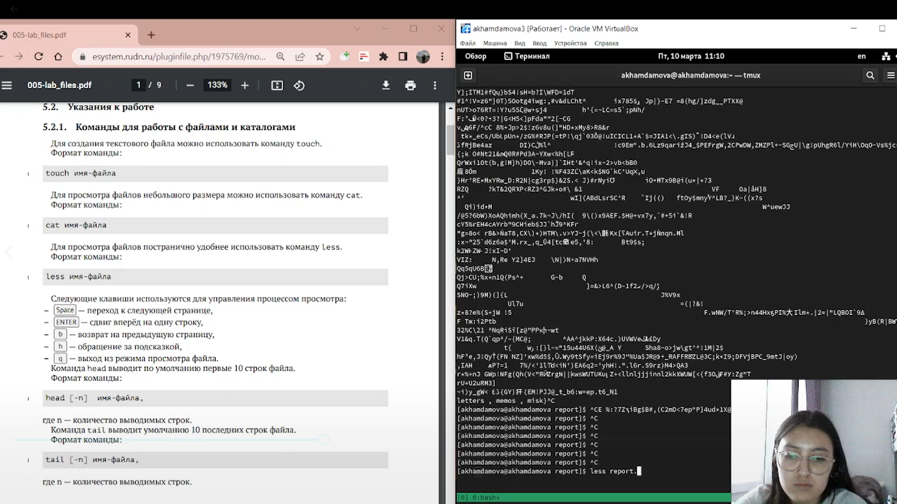

Скопируем файл /usr/include/sys/io.h в домашний каталог и назовем его
equipment. 

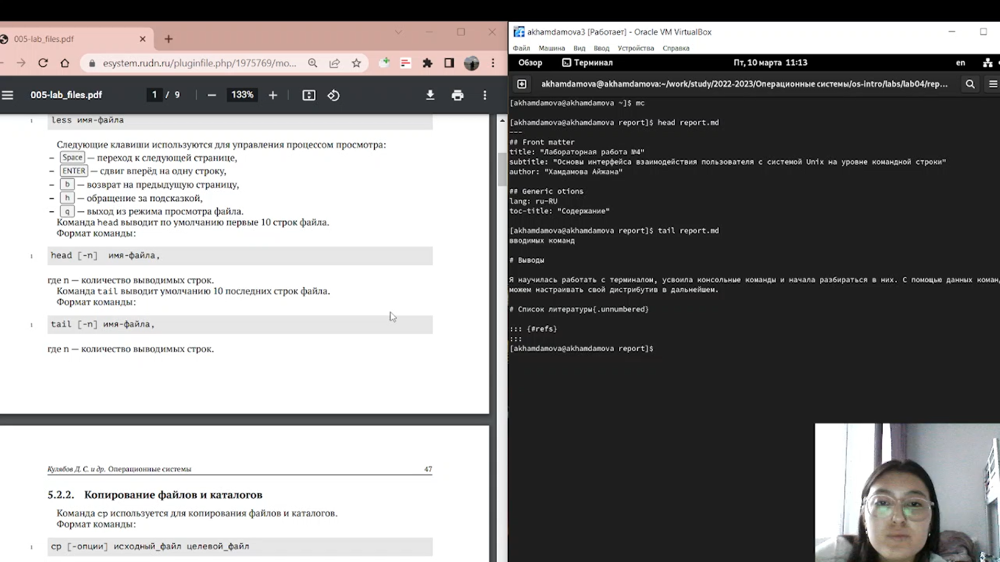

В домашнем каталоге создадим директорию ~/ski.plases.
 Переместим файл equipment в каталог ~/ski.plases.
 Переименуем файл ~/ski.plases/equipment в ~/ski.plases/equiplist
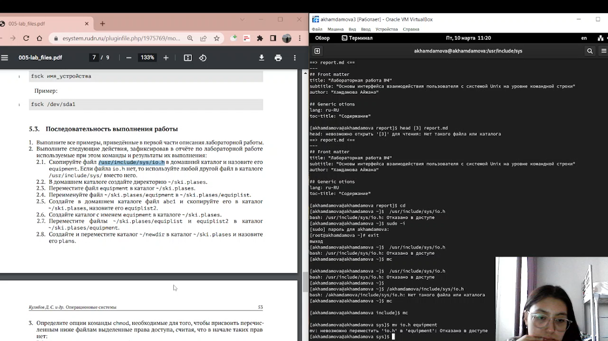

Создадим в домашнем каталоге файл abc1 и скопируем его в каталог
~/ski.plases, назовите его equiplist2.
Создадим каталог с именем equipment в каталоге ~/ski.plases.
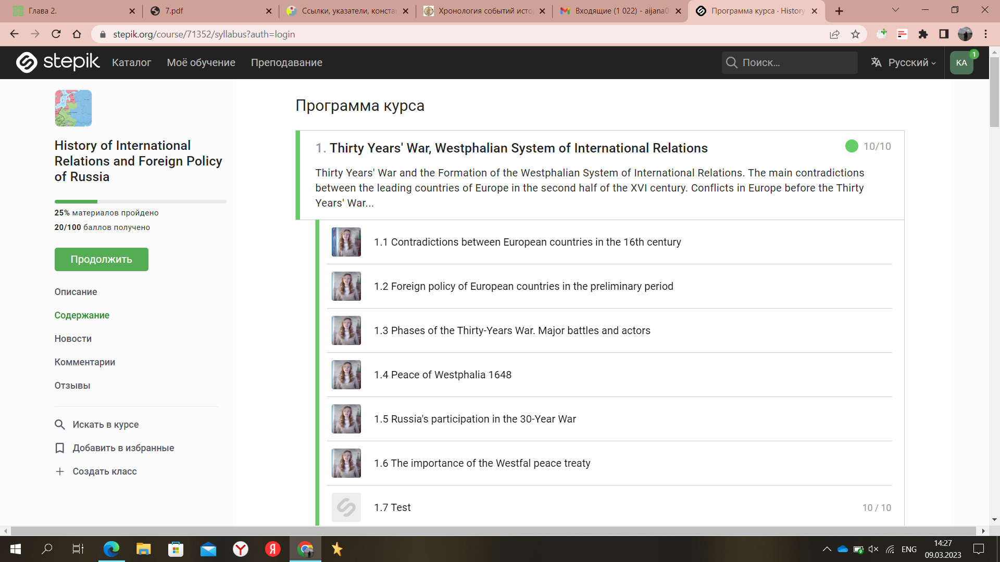

Переместим файлы ~/ski.plases/equiplist и equiplist2 в каталог
~/ski.plases/equipment. Создадим и переместим каталог ~/newdir в каталог ~/ski.plases и назовем
его plans.

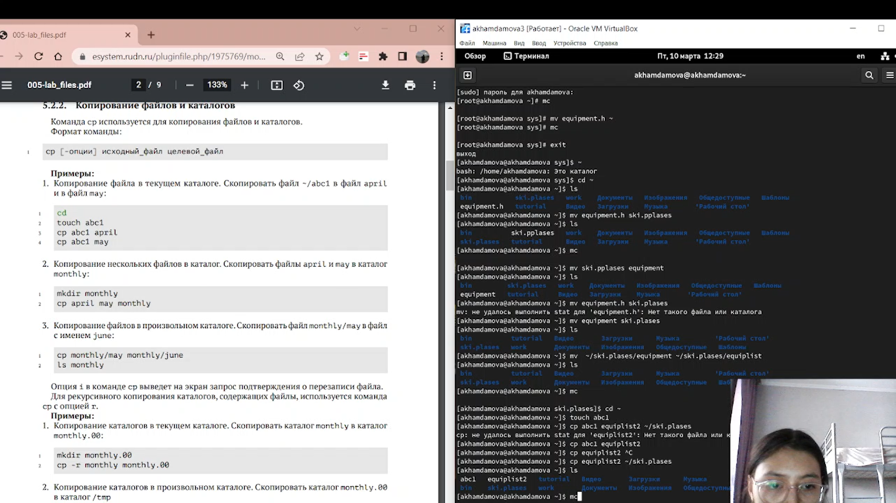

Опции команды chmod

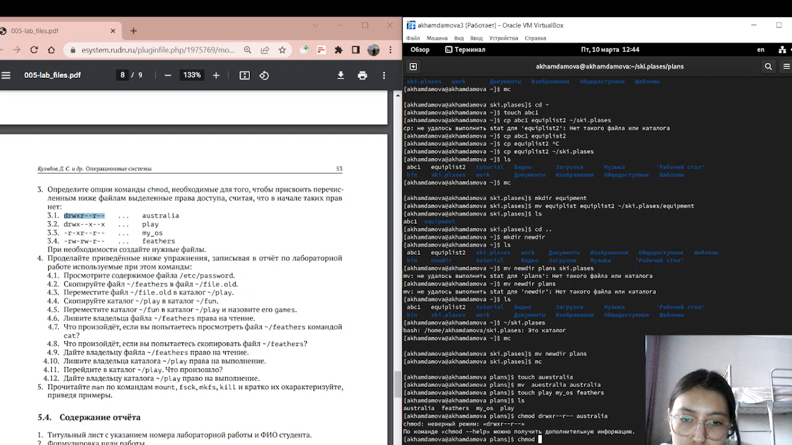

Просмотрим содержимое файла /etc/password.Скопируем файл ~/feathers в файл ~/file.old.

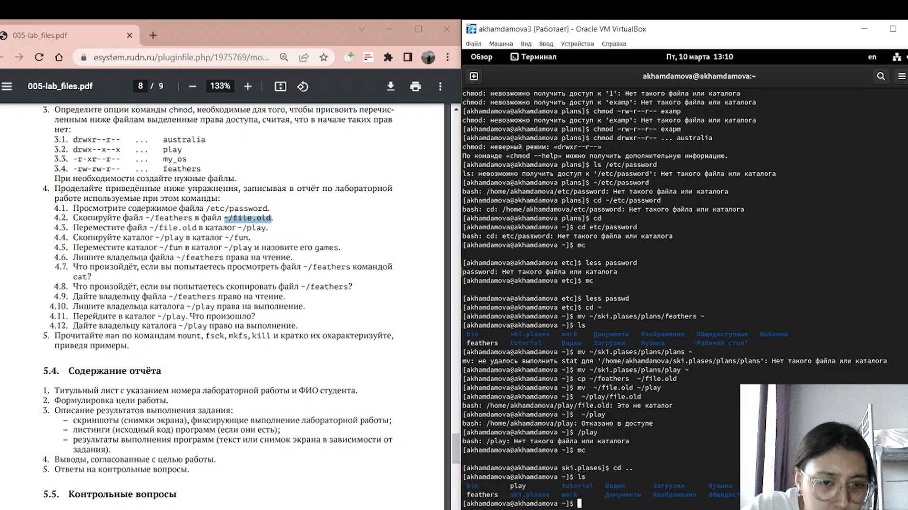

Переместим файл ~/file.old в каталог ~/play. Скопируем каталог ~/play в каталог ~/fun.

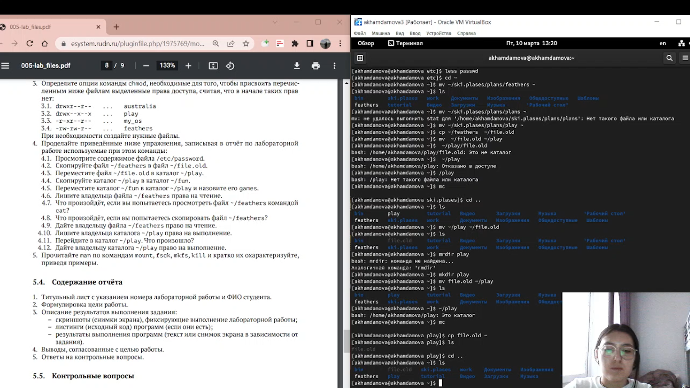

Переместим каталог ~/fun в каталог ~/play и назовем его games. Лишить владельца файла ~/feathers права на чтение.
Что произойдёт, если вы попытаетесь просмотреть файл ~/feathers командой
cat? Что произойдёт, если вы попытаетесь скопировать файл ~/feathers?

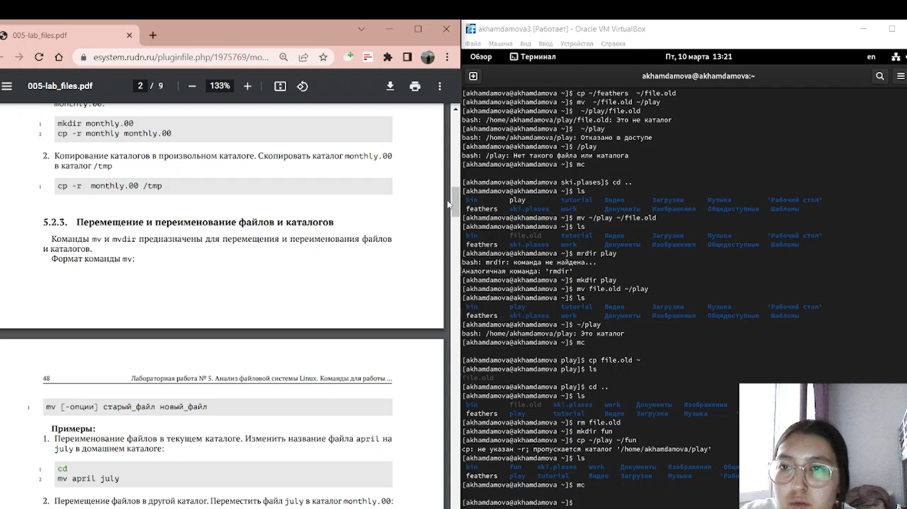

 Дайте владельцу файла ~/feathers право на чтение.Лишить владельца каталога ~/play права на выполнение.
Перейдите в каталог ~/play. Что произошло?
Дадим владельцу каталога ~/play право на выполнение.
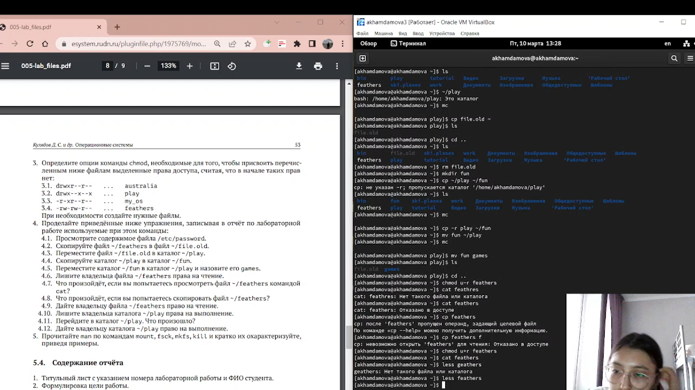

Прочитать man по командам mount, fsck, mkfs, kill 
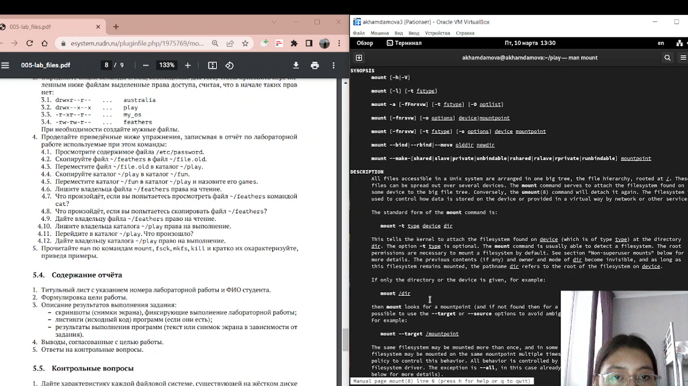

# Выводы

Я ознакомилась с с файловой системой Linux, её структурой, именами и содержанием
каталогов. Приобрела практические навыки по применению команд для работы с файлами и каталогами.

# Список литературы{.unnumbered}

::: {#refs}
:::
