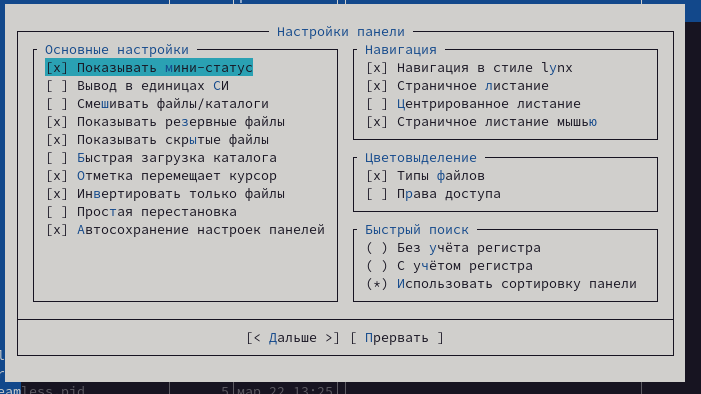

---
## Front matter
title: "Лабораторная работа №7"
subtitle: "Командная оболочка Midnight Commander"
author: "Хамдамова Айжана **НКАбд05-22**"

## Generic otions
lang: ru-RU
toc-title: "Содержание"

## Bibliography
bibliography: bib/cite.bib
csl: pandoc/csl/gost-r-7-0-5-2008-numeric.csl

## Pdf output format
toc: true # Table of contents
toc-depth: 2
lof: true # List of figures
lot: true # List of tables
fontsize: 12pt
linestretch: 1.5
papersize: a4
documentclass: scrreprt
## I18n polyglossia
polyglossia-lang:
  name: russian
  options:
	- spelling=modern
	- babelshorthands=true
polyglossia-otherlangs:
  name: english
## I18n babel
babel-lang: russian
babel-otherlangs: english
## Fonts
mainfont: PT Serif
romanfont: PT Serif
sansfont: PT Sans
monofont: PT Mono
mainfontoptions: Ligatures=TeX
romanfontoptions: Ligatures=TeX
sansfontoptions: Ligatures=TeX,Scale=MatchLowercase
monofontoptions: Scale=MatchLowercase,Scale=0.9
## Biblatex
biblatex: true
biblio-style: "gost-numeric"
biblatexoptions:
  - parentracker=true
  - backend=biber
  - hyperref=auto
  - language=auto
  - autolang=other*
  - citestyle=gost-numeric
## Pandoc-crossref LaTeX customization
figureTitle: "Рис."
tableTitle: "Таблица"
listingTitle: "Листинг"
lofTitle: "Список иллюстраций"
lotTitle: "Список таблиц"
lolTitle: "Листинги"
## Misc options
indent: true
header-includes:
  - \usepackage{indentfirst}
  - \usepackage{float} # keep figures where there are in the text
  - \floatplacement{figure}{H} # keep figures where there are in the text
---

# Цель работы

Освоение основных возможностей командной оболочки Midnight Commander. Приобретение навыков практической работы по просмотру каталогов и файлов; манипуляций с ними.

# Теоретическое введение

 Общие сведения
Командная оболочка — интерфейс взаимодействия пользователя с операционной системой и программным обеспечением посредством команд.
Midnight Commander (или mc) — псевдографическая командная оболочка для UNIX/Linux систем. Для запуска mc необходимо в командной строке набрать mc и нажать Enter .
Рабочее пространство mc имеет две панели, отображающие по умолчанию списки файлов двух каталогов
Над панелями располагается меню, доступ к которому осуществляется с помощью клавиши F9 . Под панелями внизу расположены управляющие экранные кнопки, ассоциированные с функциональными клавишами F1 – F10 . Над ними располагается командная строка, предназначенная для ввода команд.
Редактор mc
Встроенный в mc редактор вызывается с помощью функциональной клавиши F4 . В нём
удобно использовать различные комбинации клавиш при редактировании содержимого
(как правило текстового) файла

# Выполнение лабораторной работы

1. Изучим информацию о mc, вызвав в командной строке man mc

{width=70%}

2. Запустим из командной строки mc, изучим его структуру и меню.

{#fig:00 width=70%}

3. Выполним несколько операций в mc, используя управляющие клавиши (операции с панелями; выделение/отмена выделения файлов, копирование/перемещение файлов, получение информации о размере и правах доступа на файлы и/или каталоги и т.п.

{#fig:00 width=70%}

4. Выполним основные команды меню левой (или правой) панели. Оцениv степень подробности вывода информации о файлах.

{#fig:00 width=70%}

5. Используя возможности подменю Файл , выполним: – просмотр содержимого текстового файла; – редактирование содержимого текстового файла (без сохранения результатов редактирования); – создание каталога; – копирование файлов в созданный каталог

{#fig:00 width=70%}

{#fig:00 width=70%}

{#fig:00 width=70%}

{#fig:00 width=70%}

7. С помощью соответствующих средств подменю Команда осуществим:
* поиск в файловой системе файла с заданными условиями (например, файла с расширением .c или .cpp, содержащего строку main);
* выбор и повторение одной из предыдущих команд;
* переход в домашний каталог;
* анализ файла меню и файла расширений

{#fig:00 width=70%}

{#fig:00 width=70%}

{#fig:00 width=70%}

8. Вызовем подменю Настройки. Освоим операции, определяющие структуру экрана mc (Full screen, Double Width, Show Hidden Files и т.д.)

{#fig:00 width=70%}

{#fig:00 width=70%}

9. Задание по встроенному редактору mc:

Создадим текстовой файл text.txt.
Откроем этот файл с помощью встроенного в mc редактора.
Вставим в открытый файл небольшой фрагмент текста, скопированный из любого другого файла или Интернета

{#fig:00 width=70%}

{#fig:00 width=70%}

10. Откроем файл с исходным текстом на некотором языке программирования (например C или Java)

{#fig:00 width=70%}

11. Используя меню редактора выключим подсветку синтаксиса. (рис. [-@fig:018])

{#fig:018 width=70%}

# Выводы
Я смогла освоить основные возможности командной оболочки Midnight Commander и приобрела навыки практической работы по просмотру каталогов и файлов, манипуляций с ними.

# Список литературы{.unnumbered}

::: {#refs}
:::
