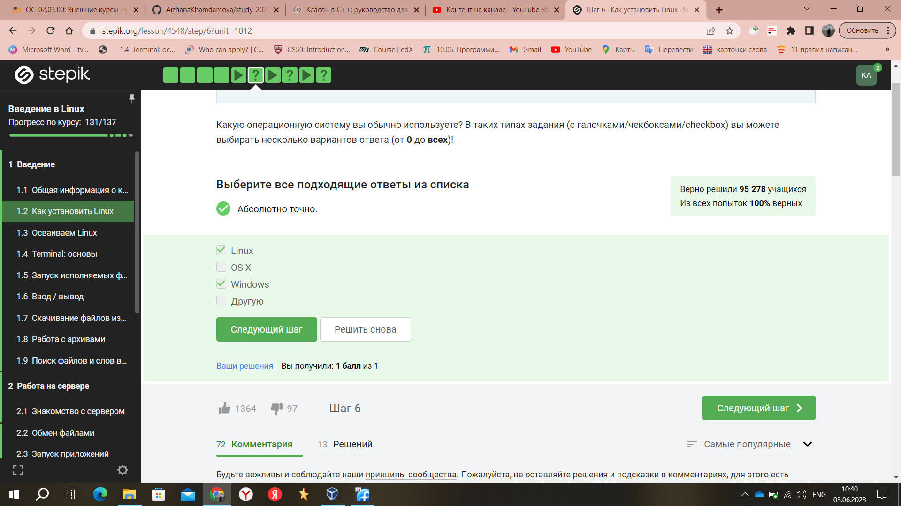
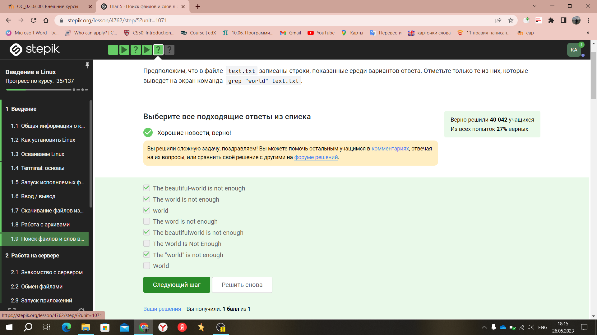
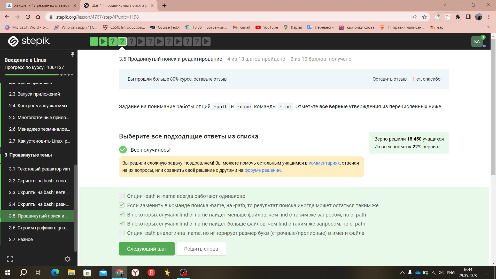

---
## Front matter
title: "Прохождение внешнего курса"
subtitle: "Введение в Linux"
author: "Хамдамова Айжана"

## Generic otions
lang: ru-RU
toc-title: "Содержание"

## Bibliography
bibliography: bib/cite.bib
csl: pandoc/csl/gost-r-7-0-5-2008-numeric.csl

## Pdf output format
toc: true # Table of contents
toc-depth: 2
lof: true # List of figures
lot: true # List of tables
fontsize: 12pt
linestretch: 1.5
papersize: a4
documentclass: scrreprt
## I18n polyglossia
polyglossia-lang:
  name: russian
  options:
	- spelling=modern
	- babelshorthands=true
polyglossia-otherlangs:
  name: english
## I18n babel
babel-lang: russian
babel-otherlangs: english
## Fonts
mainfont: PT Serif
romanfont: PT Serif
sansfont: PT Sans
monofont: PT Mono
mainfontoptions: Ligatures=TeX
romanfontoptions: Ligatures=TeX
sansfontoptions: Ligatures=TeX,Scale=MatchLowercase
monofontoptions: Scale=MatchLowercase,Scale=0.9
## Biblatex
biblatex: true
biblio-style: "gost-numeric"
biblatexoptions:
  - parentracker=true
  - backend=biber
  - hyperref=auto
  - language=auto
  - autolang=other*
  - citestyle=gost-numeric
## Pandoc-crossref LaTeX customization
figureTitle: "Рис."
tableTitle: "Таблица"
listingTitle: "Листинг"
lofTitle: "Список иллюстраций"
lotTitle: "Список таблиц"
lolTitle: "Листинги"
## Misc options
indent: true
header-includes:
  - \usepackage{indentfirst}
  - \usepackage{float} # keep figures where there are in the text
  - \floatplacement{figure}{H} # keep figures where there are in the text
---

# Цель работы

Пройти данный курс по операционным системам, потворить пройденный материал и закрепить полученные знания.

# Теоретическое введение

**Linux** — это семейство операционных систем (ОС), работающих на основе одноименного ядра. Нет одной операционной системы Linux, как, например, Windows или MacOS. Есть множество дистрибутивов (набор файлов, необходимых для установки
ПО), выполняющих конкретные задачи.

История создания Linux
Линус Торвальдс — первый разработчик и создатель Linux. Именно в честь него и была названа ОС. В 1991 году Линус начал работу над собственной ОС семейства Unix. Через три года появилась первая версия, доступная для скачивания. Но тогда она имела очень низкий спрос — ей пользовались буквально несколько человек. Только через 10 лет ОС Linux получила широкое распространение. Сообщество программистов подхватило идею свободного ПО, специалисты стали помогать развивать проект.
Где нужен Linux?
*Веб-серверы*
Дистрибутивы Linux практически полностью захватили рынок веб-серверов. Согласно рейтингу аналитического агентства W3Techs, на Linux-серверах развернуты 75,1% сайтов.

*Мобильные устройства*
ОС Android работает на ядре Linux, поэтому она используется и в мобильных устройствах.

*Суперкомпьютеры*
Это специализированные вычислительные машины, превосходящие по своим техническим параметрам и скорости вычислений многие обычные компьютеры. Они уникальны, для многих из них требуется особая ОС, способная решать конкретные задачи. Благодаря открытому исходному коду разработчики могут видоизменять ОС так, чтобы она работала и на таких машинах.

*Игровые консоли*
Linux занял свою нишу и в игровых консолях, но ориентированных на эту ОС игр пока не так много. Компания Steam работает над исправлением ситуации — разрабатывает операционную систему SteamOS. Она будет поставляться вместе с игровой консолью Steam Machine.

*Устройства IoT и умная техника*
Многие из них созданы на основе Linux. Так, компания Samsung разработала операционную систему Tize, LG — WebOS, а Panasonic и Philips используют FirefoxOS.

*Авиация и транспорт*
Во встроенных компьютерах Tesla и машинах с автопилотами Google используется операционная система Linux. ПО для отслеживания трафика в США аналогично разработано на этой ОС, а администрация авиации Америки перешла на нее еще в 2006 году.

# Выполнение лабораторной работы

**Мой аккаунт в stepik.org**

**Первый раздел "Введение"**

1. Какую операционную систему вы обычно используете? 
Пояснение: на ноутбуке у меня windows10

2. Что такое виртуальная машина? 
Пояснение: Виртуальная машина - это специальная программа для запуска одной ОС на другой ОС

3.  Создайте документ в OpenOffice/LibreOffice Writer (аналог Microsoft Word) и напишите в нём шрифтом FreeMono (если такого шрифта у вас нет, то используйте Arial или Times New Roman) одну-единственную строчку. После этого сохраните этот документ в формате XML (Microsoft Word 2003 XML) или в формате FODT (OpenDocument Text: Flat XML) и загрузите в форму ниже.

4. Какое расширение имеют установочные пакеты в Linux (Ubuntu)?

5. Поставьте себе в систему плеер VLC (любым способом: через Software Center или скачиванием установочного пакета с сайта VLC).

6. Для чего можно использовать приложение Update Manager?

7. Выберите все синонимы для “командной строки”.

8. Какая команда напечатает в какой директории мы сейчас находимся?
Пояснение: знала из курса "Операционные системы"

9.  Укажите, какие из следующих команд полностью эквивалентны команде ls -A --human-readable -l /some/directory

10. Предположим, что вы находитесь в директории /home/bi/Documents, причем /home/bi — ваша домашняя директория. Какая(ие) команда выведет содержимое /home/bi/Downloads, при этом не показывая содержимое других директорий?
Пояснение: знала из курса "Операционные системы"

11. Какая команда используется для удаления директорий?
Пояснение: знала из курса "Операционные системы"

12. Что произойдет, если ввести в терминал команду firefox (для запуска одноименного браузера), а затем ввести туда же команду exit?

13. Чему эквивалентен запуск программы с &?

14. Скачайте файл с программой, сделайте его исполняемым, запустите и скопируйте то, что он выведет на экран, в форму ниже.

15. Куда по умолчанию выводится поток ошибок из программы, запущенной в терминале?

16. Какие (какая) из команд создадут файл file.txt и запишут в него поток ошибок программы program? Считайте, что в момент запуска программы файл file.txt не существует.

17. Куда деваются сообщения об ошибках (т.е. вывод в stderr) от тех программ, которые объединены в конвейер (pipe)?

18. В каком файле на диске окажется картинка, если для её скачивания были выполнены следующие команды?

19. Какую опцию нужно указать команде wget, чтобы она не выводила никаких сообщений на экран (Resolving.., Connecting to.. и т.д.)?

20. Пусть на некоторой web-странице есть ссылки на картинки в форматах png и jpg, а также ссылки на другие страницы сайта (обычные html файлы). Какие файлы будут скачаны на компьютер, если запустить wget -r -l 1 -A jpg и передать в качестве аргумента ссылку на эту web-страницу? 

21. Чем отличаются архиваторы gzip и zip?

22. Какие из перечисленных программ-архиваторов могут создать архив из директории с файлами?

23. Какой набор опций нужно указать программе tar, чтобы запаковать файлы в my_archive.tar.bz2?

24. Откройте терминал нажатием "Open Terminal". Скачайте в нем архив https://stepik.org/media/attachments/course73/quiz_archive.tar.gz в директорию /home/box (для этого вам пригодится команда wget, см. предыдущее занятие).Распакуйте этот архив с использованием ровно одной команды терминала.

25. Какая маска команды find НЕ найдет файл Alexey.jpeg?

26. Предположим, что в файле  text.txt записаны строки, показанные среди вариантов ответа. Отметьте только те из них, которые выведет на экран команда  grep "world" text.txt.

27. Cкачайте архив с произведениями Шекспира. Вам нужно сгенерировать файл, в котором будут все строчки из этих произведений, содержащие “love”, и загрузить этот файл в форму.

**Второй раздел "Работа на сервере"**

1. Для каких задач можно использовать удаленный сервер?

2.  Предположим программа ssh-keygen создала вам два ключа: id_rsa и id_rsa.pub. Какой из этих ключей можно без опаски пересылать по интернету?

3.  Для начала выполнения нажмите кнопку "Open Terminal". Открывшийся в браузере терминал будем называть "локальный". Зайдите с этого терминала по SSH на удаленный сервер server1.stepik-local. Для доступа к серверу используйте логин box и пароль supersecret, а порт указывать не нужно -- используется порт по умолчанию.

4. Какая команда скопирует на сервер (в домашнюю директорию) папку stepic вместе с содержимым ее самой и всех ее подпапок?

5. Предположим, что вы устанавливаете программу program на свой компьютер при помощи команды sudo apt-get install program. Терминал сообщает вам, что он не может найти и скачать установочный пакет. Какие действия могут устранить проблему?

6. Для чего можно использовать программу Filezilla?

7. Что можно сделать, если требуется запустить на сервере программу, для работы которой нужен не терминал, а экран?

8. Как обычно можно вызвать справочную информацию о программе program?

9. Посмотрите справку по программе FastQC (имеется ввиду вариант для запуска в терминале) и определите, какие форматы данных он может принимать на вход.

10. Посмотрите справку по программе (имеется в виду версия для терминала) и впишите в поле ниже команду, которая запускает в терминале Clustal на файле test.fasta и выполняет множественное выравнивание (multiple alignment). 

11. Предположим вы запустили программы program1, program2 и program3 в фоновом режиме. После этого вы выполнили следующие действия:fg %1 Ctrl+С fg %2 Ctrl+Z jobs
Информация о каких программах будет показана при выполнении команды jobs?

12. jobs, top и ps позволяют отслеживать работу запущенных в терминале программ. В каждой из этих трех утилит для каждой запущенной программы указывается число-идентификатор. Одинаковые ли эти идентификаторы в  jobs, top и ps?

13. С помощью какой команды можно мгновенно завершить остановленный процесс?

14. Что произойдет, если использовать kill (без опций) по отношению к процессу, который был приостановлен при помощи Ctrl+Z?

15. Сколько вычислительных ресурсов центрального процессора (% CPU) использует остановленное (по Ctrl+Z) многопоточное приложение?

16. Сколько памяти занимает остановленное (по Ctrl+Z) многопоточное приложение?

17. Как принудительно завершить один из потоков запущенного многопоточного приложения?

18. Изучите справочную информацию об этих подпрограммах (можно вызвать при помощи --help) и ответьте на вопрос -- какой(ие) из этих шагов можно выполнить в несколько потоков?

19. Скачайте файлы, необходимые для запуска bowtie2: референсный геном (reference) и риды (reads). Запустите программу bowtie2 на этих данных 

20. Вы открыли две вкладки в терминале. В одной из них вы запустили процесс и приостановили его. Переключившись во вторую вкладку и набрав fg, вы добьетесь следующего:

21. Предположим, что в tmux осталась последняя открытая вкладка. Что произойдет, если вы введете в этой вкладке в командную строку команду exit?

22. Предположим, что вы открыли терминал, зашли в нем на сервер, запустили на этом сервере tmux и начали работу в
нем. Что произойдет, если вы теперь закроете терминал?

23. Что произойдет, если запустить процесс в фоновом режиме в одной из вкладок tmux, а затем принудительно закрыть эту вкладку (Ctrl+B, X)?

24. Задание на самостоятельное изучение tmux. 

25. Задание на самостоятельное изучение tmux. 

**Третий раздел "Продвинутые темы"**

1. Какую клавишу(и) нужно нажать на клавиатуре, чтобы выйти из редактора vim? Считайте, что вы только что открыли файл и вам сразу понадобилось выйти из редактора.

2. При перемещении в vim "по словам" есть небольшая разница в том, используем мы маленькую (w, e, b) или большую (W, E, B) букву. Первые перемещают нас по "словам" (word), а вторые по "большим словам" (WORD). Посмотрите справку по этим перемещениям и разберитесь в чем заключается разница между word и WORD.

3. Предположим, что в текстовом файле записана одна единственная строка: one two three four five и вам нужно преобразовать её в строку three four four four five

4. Предположим, что вы открыли файл в редакторе vim и хотите заменить в этом файле все строки, содержащие слово Windows, на такие же строки, но со словом Linux. Если в какой-то строке слово Windows встречается больше, чем один раз, то заменить на Linux в этой строке нужно только самое первое из этих слов.Какую команду нужно ввести для этого в vim?

5. Мы совсем не рассказали вам про третий режим работы vim -- режим выделения (Visual).

6. Если теперь вы попробуете при помощи стрелочек вверх/вниз перемещаться по истории набранных команд, то команды из какого набора(ов) будут появляться?

7. Предположим, что вы находитесь в директории /home/bi/Documents/ и запускаете в ней скрипт следующего содержания:

8. Вы можете скачать и изучить скрипты, которые мы показали в видеофрагменте: variables1.sh, variables2.sh.
Какие из представленных ниже строк могут быть именами переменных в bash? Выберите все подходящие варианты!
Пояснение: скачала и изучила файлы

9. Вы можете скачать и изучить скрипт, который мы показали в видеофрагменте: arguments.sh. Напишите скрипт на bash, который принимает на вход два аргумента и выводит на экран строку.

10. Вы можете скачать и изучить скрипт, который мы показали в видеофрагменте: branching1.sh. Предположим, вы пишете скрипт на bash и хотите использовать в нем конструкцию if в следующем фрагменте. 

11. Какие строки и в какой последовательности он выведет на экран, если сначала этот скрипт запустили задав переменную var=3, а затем запустили еще раз, но уже с var=5.

12. Посмотрите на фрагмент bash-скрипта:
for str in a , b , c_d
do
  echo "start" 
  if [[ $str > "c" ]]
  then
    continue
  fi
  echo "finish"
done

Если запустить этот скрипт, то сколько раз на экран будет выведено слово "start", а сколько раз слово "finish"?

13. Напишите скрипт на bash, который принимает на вход один аргумент (целое число от 0 до бесконечности), который будет обозначать число студентов в аудитории. В зависимости от значения числа нужно вывести разные сообщения. 

13. Какие(ая) из предложенных ниже инструкций увеличат значение переменной а на значение переменной b? Например, если в а было записано 10, в b было 5, то в а должно записаться 15. 

Напишите скрипт на bash, который будет определять в какую возрастную группу попадают пользователи. При запуске скрипт должен вывести сообщение "enter your name:" и ждать от пользователя ввода имени (используйте read, чтобы прочитать его). Когда имя введено, то скрипт должен написать "enter your age:" и ждать ввода возраста (опять нужен read). Когда возраст введен, скрипт пишет на экран "<Имя>, your group is <группа>", где <группа> определяется на основе возраста по следующим правилам:

младше либо равно 16: "child",
от 17 до 25 (включительно): "youth",
старше 25: "adult".

14. Пусть вы находитесь в директории /home/bi/Documents/ и запускаете в ней скрипт следующего содержания
Что в этом случае выведет команда echo на экран?

15. Если хочется всё-таки запустить программу program, которая пишет что-то в stdout и потом выполнить какие-то действия если ее код возврата равен 0? Выберите все верные утверждения или правильно работающие конструкции if.

16. Впишите в форму ниже строку, которую выведет на экран команда echo "counters are $c1 and $c2" если она находится в скрипте после десяти вызовов функции counter с параметрами сначала 1, затем 2, затем 3 и т.д., последний вызов с параметром 10.

Напишите скрипт на bash, который будет искать наибольший общий делитель (НОД, greatest common divisor, GCD) двух чисел. При запуске ваш скрипт не должен ничего писать на экран, а просто ждет ввода двух натуральных чисел через пробел (для этого можно использовать read и указать ему две переменные -- см. пример в видеофрагменте). После ввода чисел скрипт считает их НОД и выводит на экран сообщение "GCD is <посчитанное значение>", например, для чисел 15 и 25 это будет "GCD is 5".

Напишите калькулятор на bash. При запуске ваш скрипт должен ожидать ввода пользователем команды (при этом на экран выводить ничего не нужно). Команды могут быть трех типов: 

17. Пусть в директории /home/bi лежат файлы Star_Wars.avi, star_trek_OST.mp3, STARS.txt, stardust.mpeg, Eddard_Stark_biography.txt.Отметьте все файлы, которые найдет команда find /home/bi -iname "star*", но НЕ найдет команда find /home/bi -name "star*"?

18. Задание на понимание работы опций -path и -name команды find. Отметьте все верные утверждения из перечисленных ниже.

19. Какие(ой) из трех файлов (file1, file2, file3) будут найдены по команде find /home/bi -mindepth 2 -maxdepth 3 -name "file*"?

20. какая(ие) из них создаст файл results.txt наибольшего размера?

21. Предположим, что в файле  text.txt записаны строки, показанные среди вариантов ответа. Отметьте только те из них, которые выведет на экран команда  grep -E "[xklXKL]?[uU]buntu$" text.txt.

22. Что произойдет, если в команде sed -n "/[a-z]*/p" text.txt не указывать опцию -n?

23. Запишите в форму ниже инструкцию sed, которая заменит все "аббревиатуры" в файле input.txt на слово "abbreviation" и запишет результат в файл edited.txt (на экран при этом ничего выводить не нужно). Обратите внимание, что в инструкции должны быть указаны и сам sed, и оба файла!

24. Какую опцию нужно указать при запуске gnuplot, чтобы при его закрытии не были автоматически закрыты и все нарисованные в нём графики?

25. Какое в этом случае будет название у построенного ряда данных и сколько будет нарисовано точек на графике?

26. Впишите в форму ниже одну команду (т.е. одну строку), которую нужно добавить в скрипт, для выполнения этой задачи.

27. Если вы не скачали на предыдущем шаге файлы animated.gnu и move.rot, то скачайте их теперь, т.к. они понадобятся для выполнения задания. 

28. Какая команда(ы) установят файлу file.txt права доступа rwxrw-r--, если изначально у него были права r--r--r--. Укажите все верные варианты ответа!
Пояснение: проверила в терминале

29. После выполнения какой команды user из группы group всё-таки сможет создать файл внутри dir?

30. Отметьте какие характеристики файла можно посчитать с использованием команды wc.

31. Впишите в форму ниже команду, которая выведет сколько места на диске занимает текущая директория (при этом размер нужно вывести в удобном для чтения формате (например, вместо 2048 байт надо выводить 2.0К) и больше на экран выводить ничего не нужно)

32.  Впишите в форму ниже максимально короткую команду (т.е. в которой минимально возможное число символов), которая позволит создать в текущей директории 3 поддиректории с именами dir1, dir2, dir3. 

**СЕРТИФИКАТ**

