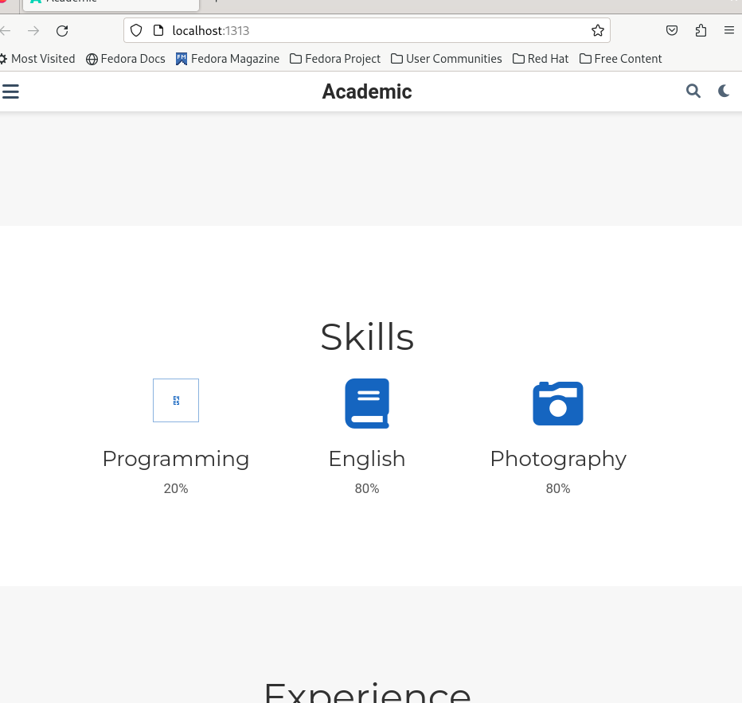
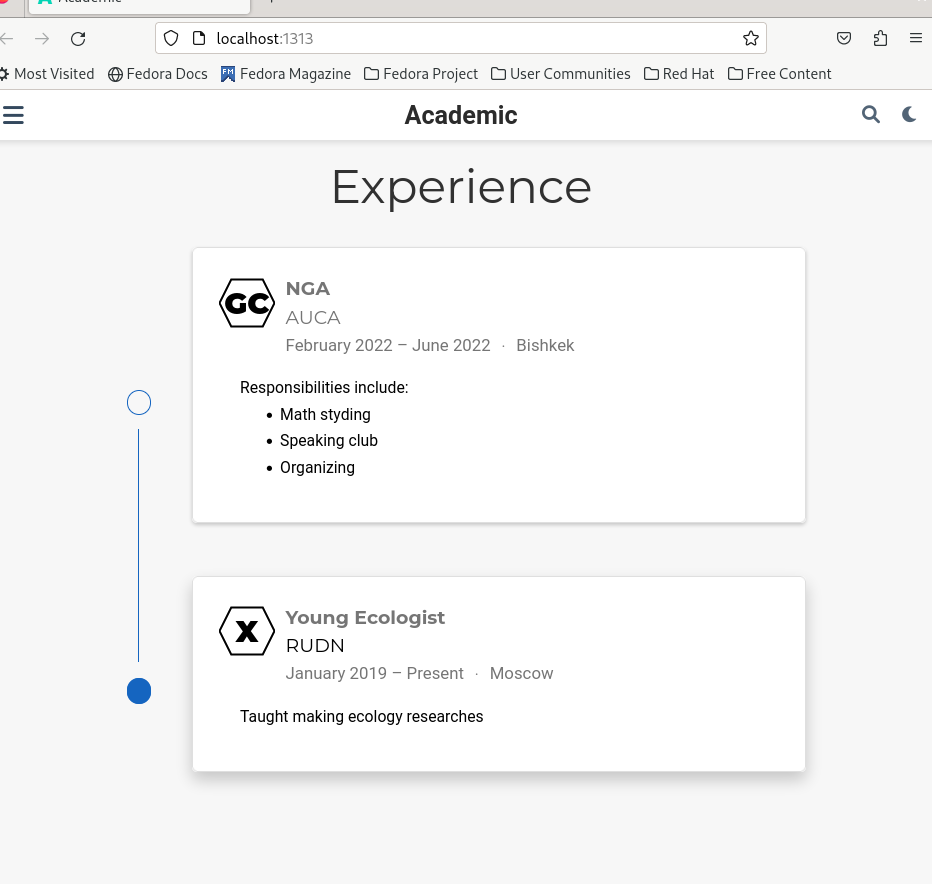
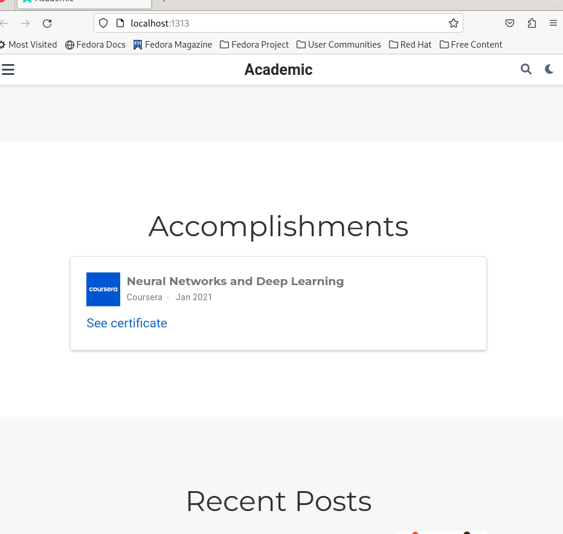
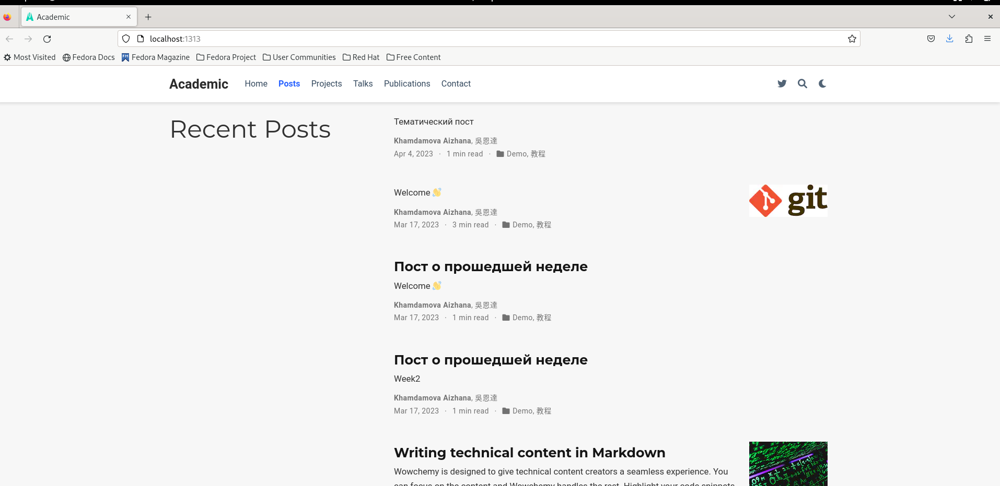
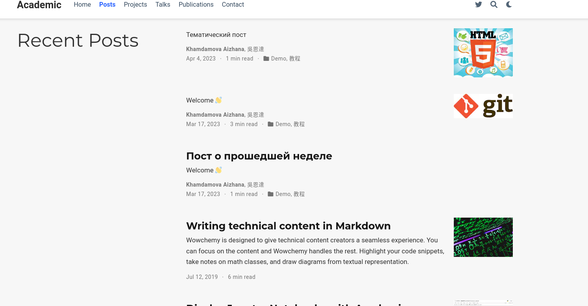

---
## Front matter
lang: ru-RU
title: Второй этап индивидуального проекта
subtitle: Обновление информации сайта
author:
  - Хамдамова А.А.
institute:
  - Российский университет дружбы народов, Москва, Россия

## i18n babel
babel-lang: russian
babel-otherlangs: english

## Formatting pdf
toc: false
toc-title: Содержание
slide_level: 2
aspectratio: 169
section-titles: true
theme: metropolis
header-includes:
 - \metroset{progressbar=frametitle,sectionpage=progressbar,numbering=fraction}
 - '\makeatletter'
 - '\beamer@ignorenonframefalse'
 - '\makeatother'
---

# Информация

## Докладчик

 * **Хамдамова Айжана** 
 * студент группы **НКАбд-05-22**
 * направление *"Фундаментальная информатика и информационные технологии"* 
 * Российский университет дружбы народов
 * [1032225989@pfur.ru](mailto:1032225989@pfur.ru)
 * <https://github.com/AizhanaKhamdamova/study_2022-2023_os-intro>
 
 

## Цели и задачи

- Добавить к сайту информацию о себе.
- Добавить информацию о навыках (Skills).
- Добавить информацию об опыте (Experience).
- Добавить информацию о достижениях (Accomplishments).
- Сделать пост по прошедшей неделе.
- Добавить пост на тему по выбору.

## Основные этапы работы 

- Редактируем файл Skills, чтобы изменить информацию о своих навыках. 
- Добавляем информацию об опыте в сфере работы/образования
-  Напишем пост о прошедшей неделе в соответсвующих маркдауновском файле.
-  Напишем пост на тему по выбору
- Cобирается сайт

# Результаты
##

##

##

##

## 

