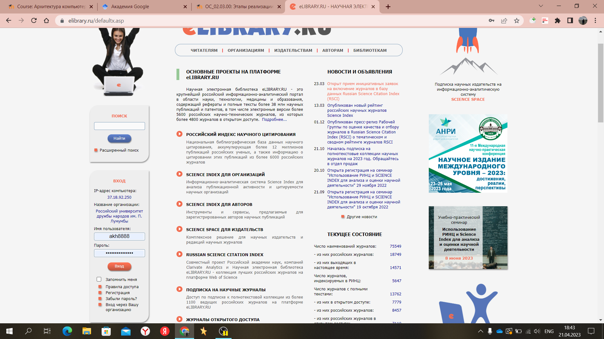
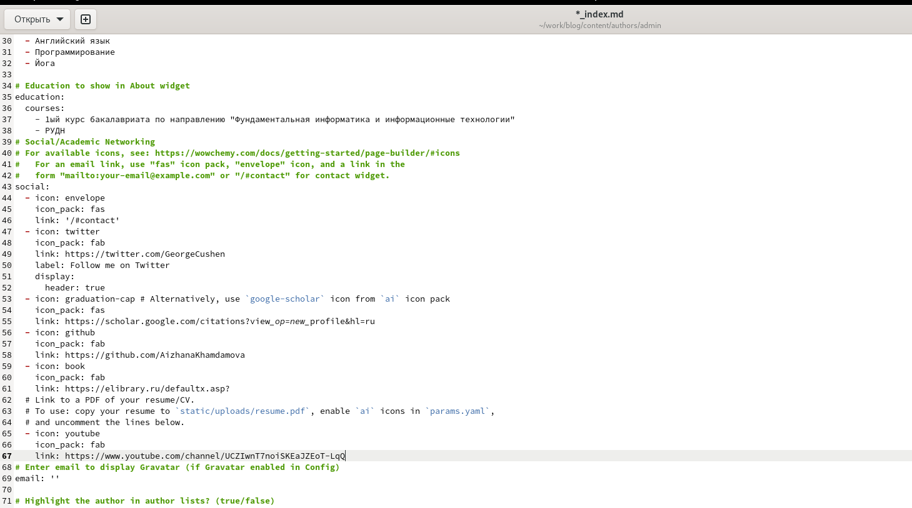
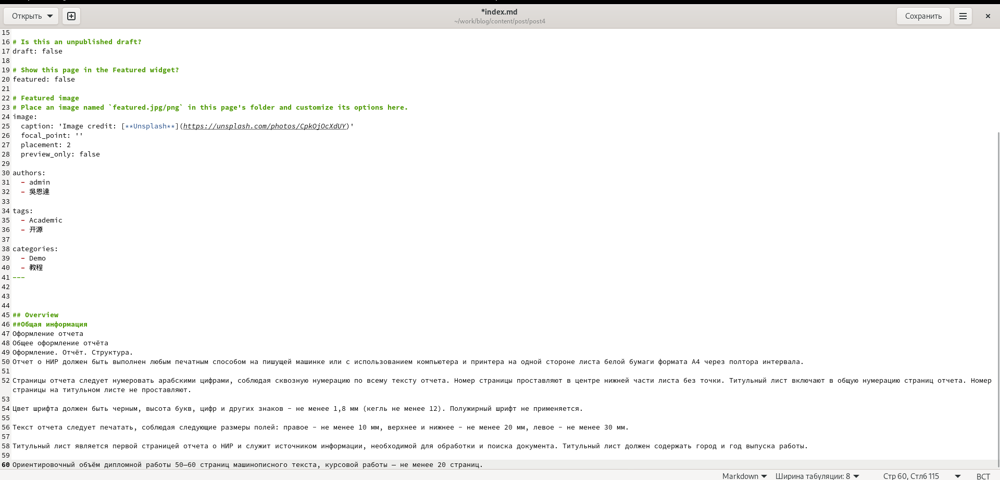
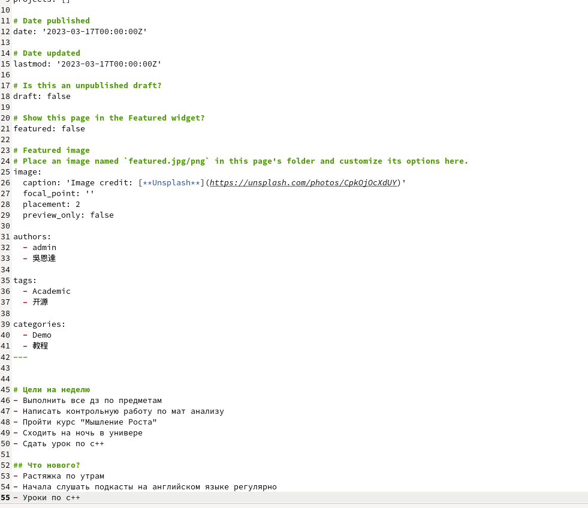
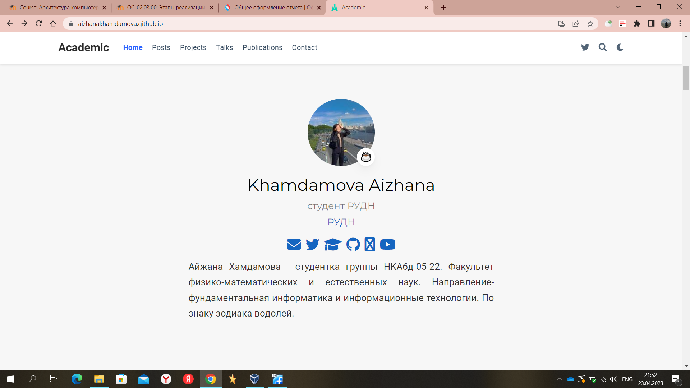

---
## Front matter
lang: ru-RU
title: Четвертый этап индивидуального проекта
subtitle: Обновление информации сайта
author:
  - Хамдамова А. А.
institute:
  - Российский университет дружбы народов, Москва, Россия
date: 23 апреля 2023

## i18n babel
babel-lang: russian
babel-otherlangs: english

## Formatting pdf
toc: false
toc-title: Содержание
slide_level: 2
aspectratio: 169
section-titles: true
theme: metropolis
header-includes:
 - \metroset{progressbar=frametitle,sectionpage=progressbar,numbering=fraction}
 - '\makeatletter'
 - '\beamer@ignorenonframefalse'
 - '\makeatother'
---

# Информация

## Докладчик

 * **Хамдамова Айжана** 
 * студент группы **НКАбд-05-22**
 * направление *"Фундаментальная информатика и информационные технологии"* 
 * Российский университет дружбы народов
 * [1032225989@pfur.ru](mailto:1032225989@pfur.ru)
 * <https://github.com/AizhanaKhamdamova/study_2022-2023_os-intro>

## Цели и задачи

- Добавить к сайту ссылки на научные и библиометрические ресурсы.

- Зарегистрироваться на соответствующих ресурсах и разместить на них ссылки на сайте:
eLibrary : https://elibrary.ru/;
Google Scholar : https://scholar.google.com/;
ORCID : https://orcid.org/;
Mendeley : https://www.mendeley.com/;
ResearchGate : https://www.researchgate.net/;
Academia.edu : https://www.academia.edu/;
arXiv : https://arxiv.org/;
github : https://github.com/.

- Сделать пост по прошедшей неделе.
- Добавить пост на тему по выбору:
- Оформление отчёта.
- Создание презентаций.
- Работа с библиографией.

## Регистрация на сайтах 

## Добавление к сайту ссылок и ресурсов моих аккаунтов

## Пост на тему "Оформление отчета"

## Написание поста о прошлой неделе

## Результаты

