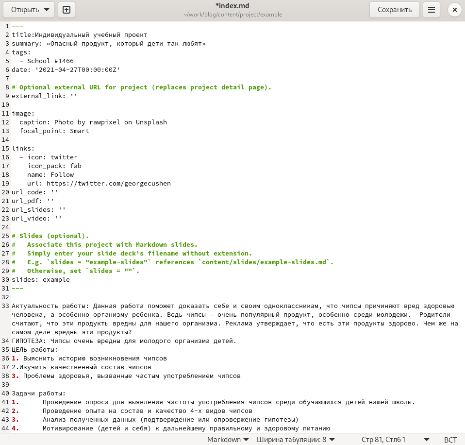
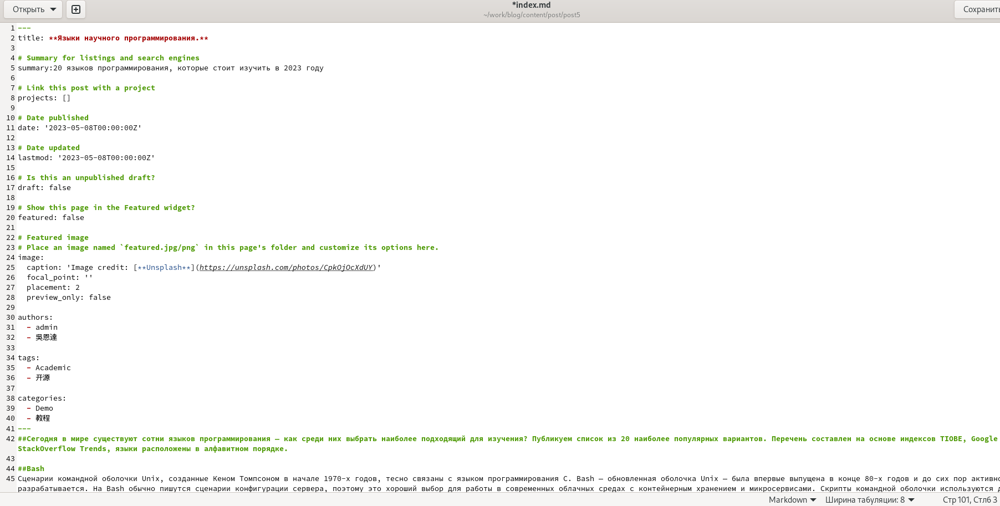
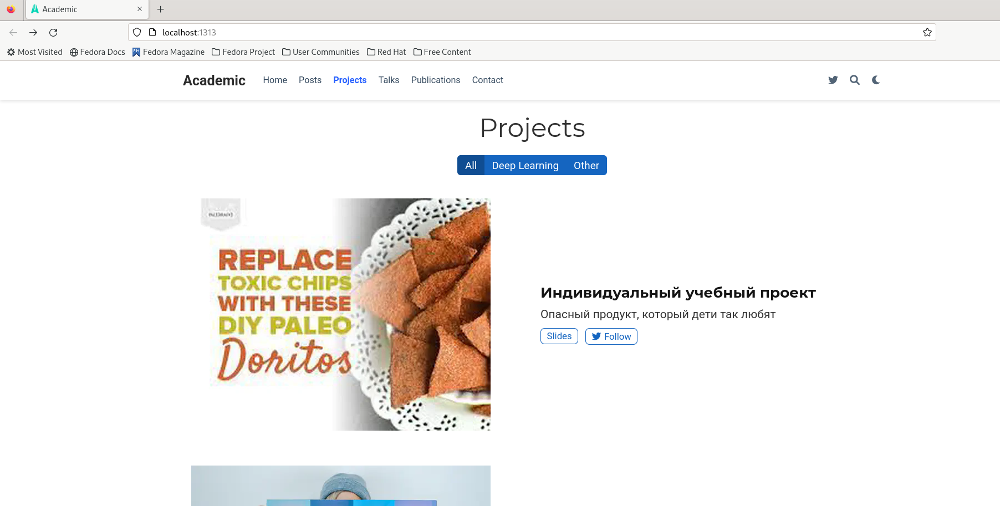
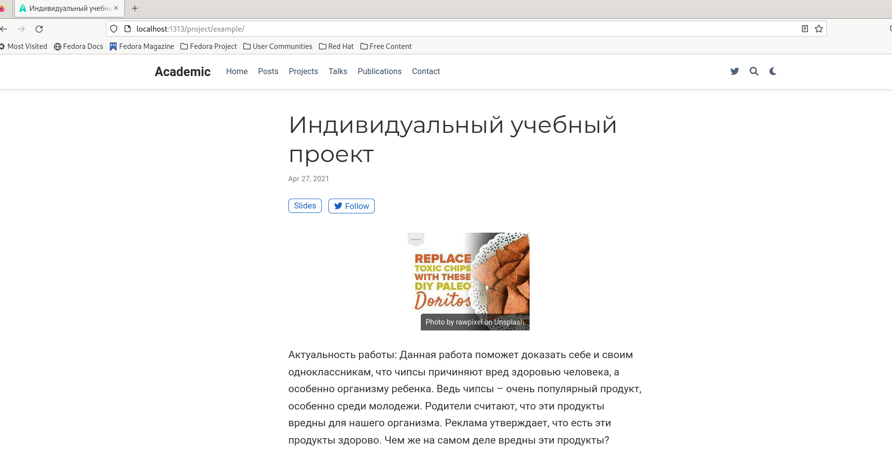

---
## Front matter
lang: ru-RU
title: Индивидуальный проект
subtitle: Пятый этап
author:
  - Хамдамова А. А.
institute:
  - Российский университет дружбы народов, Москва, Россия
date: 23 апреля 2023

## i18n babel
babel-lang: russian
babel-otherlangs: english

## Formatting pdf
toc: false
toc-title: Содержание
slide_level: 2
aspectratio: 169
section-titles: true
theme: metropolis
header-includes:
 - \metroset{progressbar=frametitle,sectionpage=progressbar,numbering=fraction}
 - '\makeatletter'
 - '\beamer@ignorenonframefalse'
 - '\makeatother'
---

# Информация

## Докладчик

 * **Хамдамова Айжана** 
 * студент группы **НКАбд-05-22**
 * направление *"Фундаментальная информатика и информационные технологии"* 
 * Российский университет дружбы народов
 * [1032225989@pfur.ru](mailto:1032225989@pfur.ru)
 * <https://github.com/AizhanaKhamdamova/study_2022-2023_os-intro>

## Цели и задачи

- Добавить с сайту все остальные элементы:

- Сделать записи для персональных проектов.
- Сделать пост по прошедшей неделе.
- Добавить пост на тему по выбору.
- Языки научного программирования.

## 1ый файл

## 2ой файл

## 3ий файл 

## Результаты 

